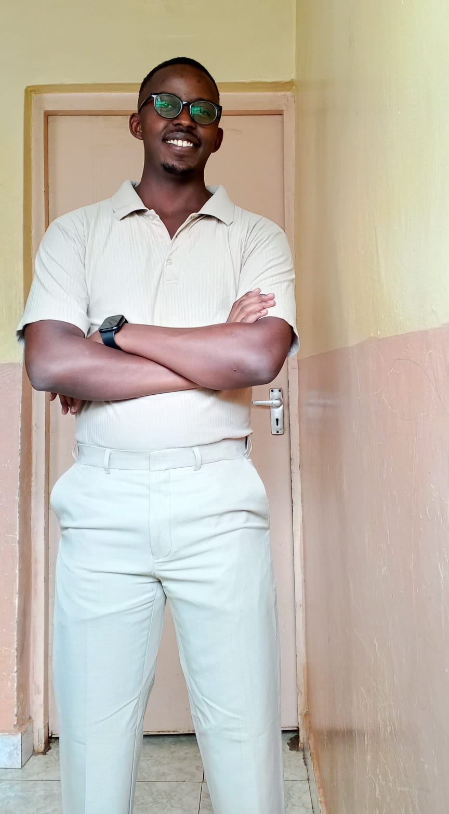

# 👋 Hi, I'm **Nelson Samuel**

{: .profile-pic }

## 💻 Cyber Security Engineer | Ethical Hacker | Digital Forensics Practitioner

> _"Securing the digital world, one investigation at a time."_

Welcome to my professional portfolio. I specialize in **ethical hacking**, **digital forensics**, and **cloud security**.  
This site showcases my journey, technical skills, research, and projects in cybersecurity.

---

### 🧠 Resume Overview
- **B.Sc. in Criminology**, [Mount Kenya University]
- **Cybersecurity Intern**, [Company Name]
- **Certifications:** Security+, CEH, AWS Cloud Practitioner

---

### 🚀 Featured Projects
- **Cloud Security Dashboard** – AWS ECS + Grafana  
- **API Security Automation** – Custom Python scripts  
- **WordPress Hardening Toolkit** – Automated WP scan and fix  

👉 [View All Projects →](/projects)

---

### 🧩 Lab Challenges
Explore my CTFs and hands-on labs.  
👉 [View Lab Challenges →](/labchallenges)

---

### 📬 Contact
- [LinkedIn](https://linkedin.com/in/your-link)
- [GitHub](https://github.com/yourusername)
- 📧 [your.email@example.com](mailto:your.email@example.com)
- ☎️ +254 7XX XXX XXX

---

_© {{ site.time | date: "%Y" }} Bruv | Built with ❤️ Nelson Samuel_

